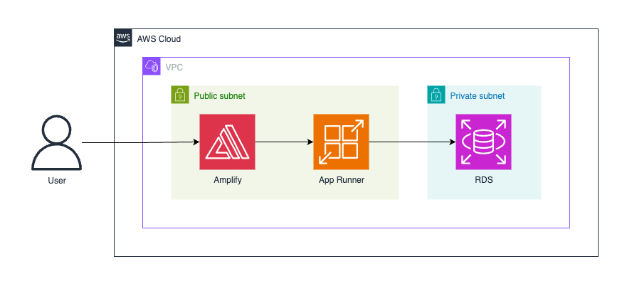

# 🤖 AI Code Review - Backend

A production-ready Java backend for AI-powered code reviews, built with Spring Boot, MySQL, and Docker.

## ⚙️ Technology Stack & Features

- 🌱 **[Spring Boot](https://spring.io/projects/spring-boot)** – modern Java backend framework
- ☕ **[Java 21](https://www.java.com/)** – latest LTS release for performance & maintainability
- 📦 **[Gradle](https://gradle.org/)** – build automation and dependency management
- 🔑 **[Spring Security](https://spring.io/projects/spring-security) + JWT** - authentication for secure sessions
- 🗄️ **[Spring Data JPA](https://spring.io/projects/spring-data-jpa)** – ORM for clean database interactions
- 🤖 **[OpenAI API](https://github.com/openai/openai-java) integration** – generates automated feedback on submitted code
- 💾 **[MySQL](https://www.mysql.com/)** – reliable SQL database
- 🐋 **[Docker](https://www.docker.com)** – containerized development & deployment
- ✅ **[JUnit 5](https://junit.org/) + [Jacoco](https://www.eclemma.org/jacoco/)** – unit & integration testing with coverage reports
- 🧹 **[Checkstyle](https://checkstyle.sourceforge.io/) + [Spotless](https://github.com/diffplug/spotless)** – code quality enforcement & auto-formatting
- 🏭 **CI/CD** – automated pipelines with GitHub Actions (linting, tests, Docker build & push)
- ☁️ **AWS** – deployment with ECR, App Runner & RDS
- 🔒 Secure password hashing by default

## 🏗️ Architecture



## 🛠️ Running Locally
1. **Set environment variables**

   Copy the example file and update with your values:
    ```bash
    cp .env.example .env
    ```
2. **Start the local backend with Docker Compose**
    ```bash
    docker compose up --build --watch
    ```
3. **Access the backend API**

   JSON-based API (OpenAPI compliant): http://localhost:8080

   Interactive Swagger UI documentation: http://localhost:8080/swagger-ui.html
